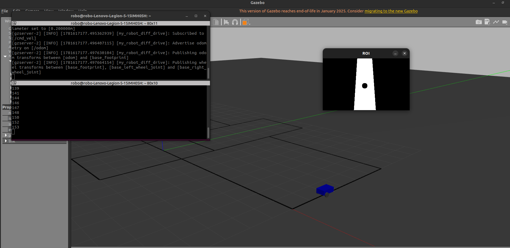

# ROS2 Line Follower Mobile Robot



A compact ROS 2 project implementing a vision-based line follower for a differential-drive mobile robot. The workspace contains perception, robot description, bringup, and world packages to simulate and run the robot locally.

Contents
- `line_cv` — computer vision package for detecting and following a line.
- `my_robot_bringup` — launch and bringup configuration for the robot.
- `my_robot_description` — URDF / meshes for the robot.
- `my_robot_worlds` — Gazebo worlds and scenarios.

Quickstart

1. Prerequisites
   - Ubuntu with a supported ROS 2 distribution installed (a recent Foxy/Humble/Rolling install should work).
   - `colcon` build tool, Python 3, and OpenCV installed for the vision package.

2. Clone

```bash
git clone https://github.com/ismailismail1234/ros2_line_follower_mobile_robot.git
cd ros2_line_follower_mobile_robot
```

3. Build

```bash
colcon build --symlink-install
source install/setup.bash
```

4. Run

- Use `ros2 launch` to start the bringup and visualization. Launch files live in `my_robot_bringup`.
- Run nodes directly with `ros2 run <package> <executable>` for specific components (for example the camera/vision node in `line_cv`).

Notes
- The included photo in the `photos` directory shows the robot used for demos and documentation.
- If you expect to push to GitHub from this machine, ensure you have your SSH key or PAT configured for the repository URL.

Contributing

Contributions, issues and feature requests are welcome. Please open a GitHub issue or submit a pull request.

License

This repository does not include a license file yet. Add a `LICENSE` file if you intend to make the project open-source.

Contact

Maintainer: Ismail (see GitHub profile at https://github.com/ismailismail1234)

